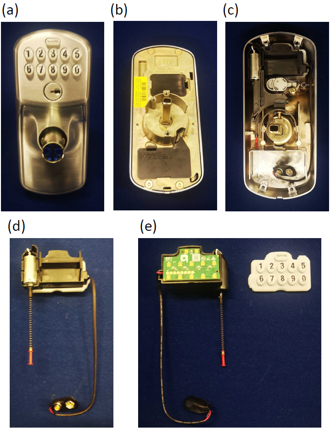
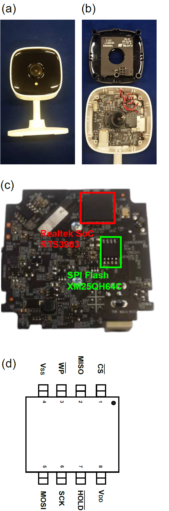

## Appendix for Leaving Your *Things* Unattended is No Joke! Memory Bus Snooping and Open Debug Interface Exploit Case Studies

### Resources
A key resource is a book by reverse engineering expert Edwin Sobey [[1]](#1). Sobey talks about salvaging useful components from broken or old electronics in this book. More importantly, readers can learn how to use correct tools to dissection the device, identify valuable parts that can be reused, basic knowledge about how they work and safety rules to follow when unscrewing devices. Notably, this book was published pre-IoT era in 2011. Some techniques are outdated with the rapid evolution of industrial design. For example, nowadays, more and more devices have their casing held together with adhesive or ultrasound welding rather than screws and clips commonly used back in 2011.

Given some familiarity with electronics, *The IoT Hacker's Handbook* written by Aditya Gupta [[2]](#1) provides in-depth insights into hardware and embedded system exploitation to firmware exploitation.

Then, www.ifixit.com is a wiki-based website for user-generated content sharing focusing on repairing technological devices. The website provides video content from experienced people with step-by-step recipes to tear down the device you want to explore. This may largely reduce the risk of having your device damaged or hurting yourself.

Another wiki-based website, www.exploitee.rs, focuses more on hacking things. We can learn how to find hidden debug interfaces and how to decrypt dumped firmware from the examples on this website.

### Attacker tools
* **Multimeter:** An US\$10 instrument that can measure basic electrical properties, such as voltage, current, resistance and so on. We recommend choosing a multimeter with diode forward biasing and wire connectivity function.
* **Logic analyzer:** An US\$15 instrument that can measure fast varying digital signals, records those signals over time domain and performs analysis to discover the information encoded.
* **Flash memory programmer:** A low-cost (US\$15) gadget to read out the Flash (generally also supports EEPROM) memory content from or write image files into the Flash memory chip. We recommend the model comes with a test clip for fast and clean hooking up the exposed memory bus.
* **JTAG programmer/debugger:** JTAG is also known as the IEEE 1149.1 standard for deploying and debugging firmware on the chip and also offers low-cost and time-saving testing for all components in a system through boundary-scan. JTAG is widely used in the industry [[3]](#1). Different system architecture may require different JTAG programmers, a US\$35 compatible JTAG programmer supports ARM, MIPS and RISC-V.
* **Embedded system development board:** Such as Raspberry Pi Zero (US\$10), Arduino UNO R3 (US\$22) or STM32 Bluebell (US\$15). Those devemopment board are useful, for example to deploy JTAGenum (https://github.com/cyphunk/JTAGenum), an open-source program for identifying JTAG pin-out definitions.

### Disassembly of Electronic Lock

 Fig.8 Tear-down of the electronic lock: (a) front side; (b) back side; (c) with back panel removed; (d) the electronic assembly; (e) the circuit board is visible after removing waterproof silicone rubber keyboard. 

### Disassembly of WiFi IP camera

 Fig.9 (a) the front side of the TP-link Tapo C100 IP camera; (b) with the front panel removed; (c) the back side of the main board; and (d) the pin definition of the MX25QH64 SPI Flash chip. 

### References
<a id="1">[1]</a> 
Sobey, Ed. 
Unscrewed: Salvage and Reuse Motors, Gears, Switches, and More from Your Old Electronics,
2011,
Chicago Review Press.

<a id="2">[2]</a> 
Gupta, Aditya.
The IoT Hacker's Handbook: A Practical Guide to Hacking the Internet of Things,
2019,
Apress.

<a id="3">[3]</a> 
Vishwakarma, Gopal and Lee, Wonjun.
Exploiting JTAG and its mitigation in IOT: a survey,
Future Internet,
volume 10, number 12, pages 121, 2018,
Multidisciplinary Digital Publishing Institute.
